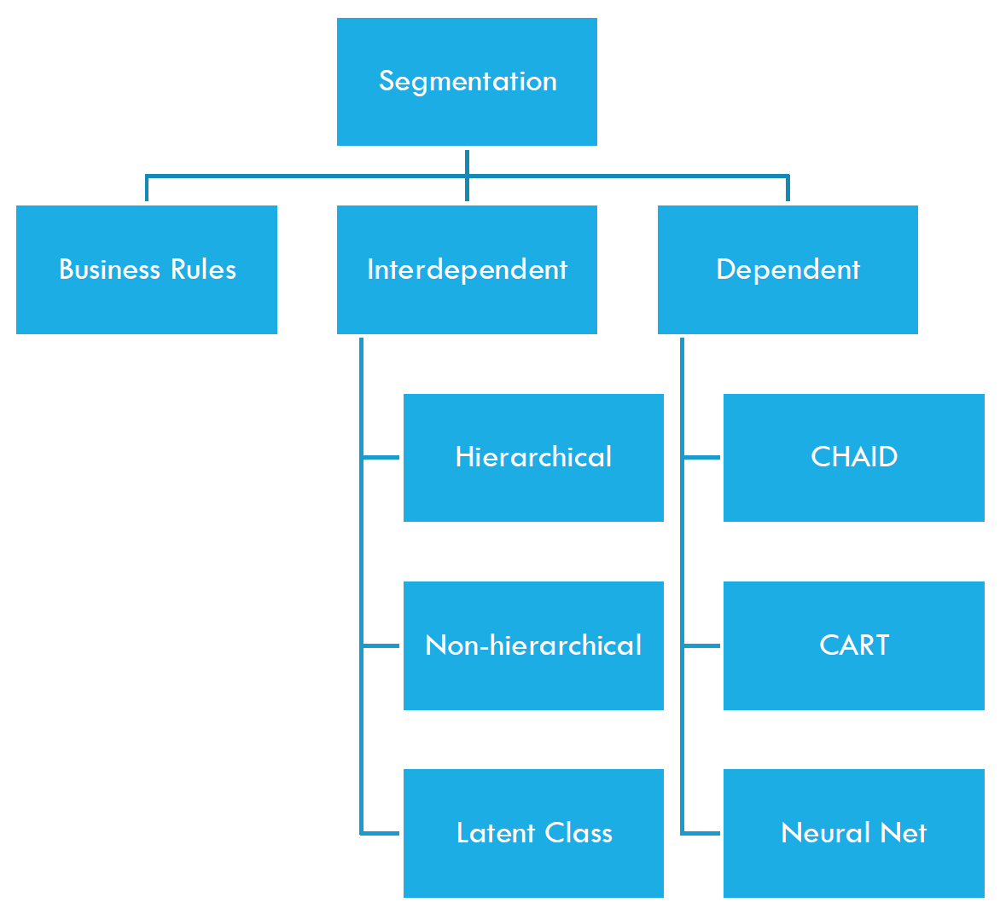
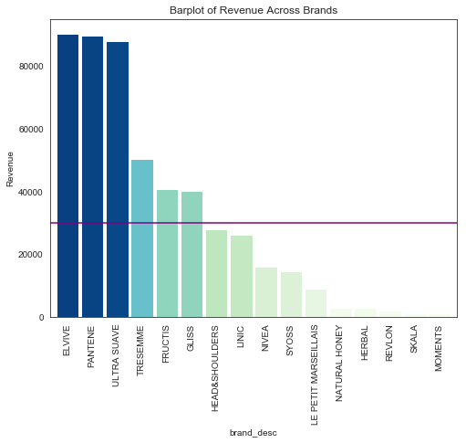
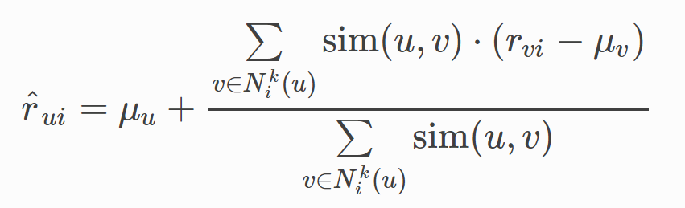
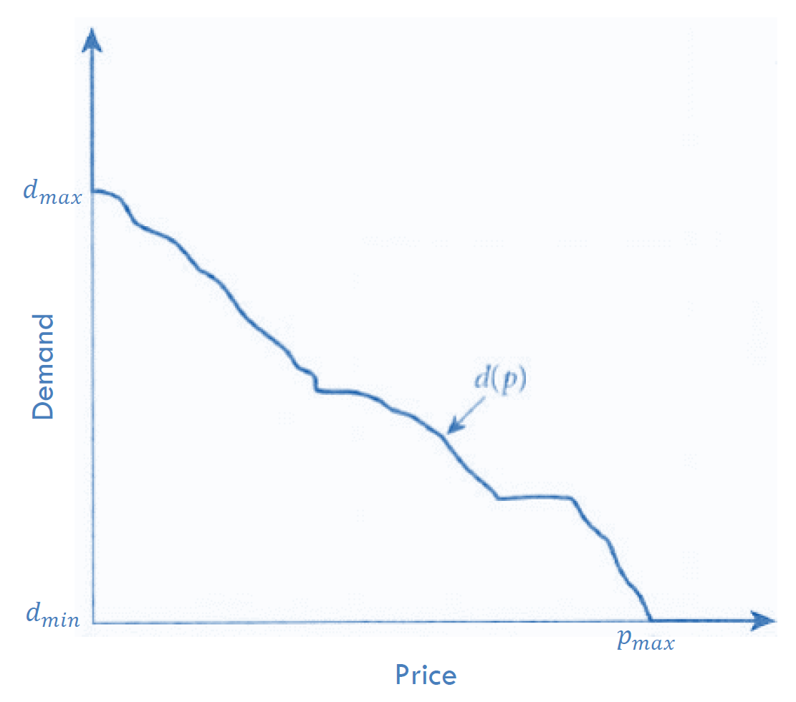
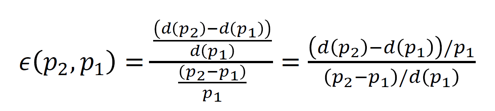

### Introduction
Marketing Analytics, one of my favorite subjects, is to analyze and evaluate the marketing efforts in order to effectively maximize return on investment. I would like to introduce the major concepts and provide a few work samples – my team projects below to present how Marketing Analytics empowers marketers to make decisions. In a real business setting, we would be interested in how customers differ in their preferences before addressing them accordingly and what products we can recommend to maximize revenue. Furthermore, the knowledge of optimizing product prices and the effectiveness of marketing vehicles will help boost ROI. 

Following the best practices from Marketing Analytics projects, four topics will be covered in this article, namely,  **segmentation**, **recommender system (with sample)**, **price optimization (with sample)** and **marketing mix modeling**. 
### Best Practices of Marketing Analytics Projects
* It is always essential to **clean the data** and transform it into the form desired before analysis. 
* Because marketers are constrained in resources to make a market-wise change and computing power is costly, it would be more efficient to **narrow down** the scope of the problem as early as possible. Filtering out irrelevant information or unqualified audiences in the early stages will keep the analysts focused on the objective and save vast computing power for upcoming complex modeling. 
* The problem could be very complex sometimes with strict time constraints. It might not be possible to make a perfect initial plan but a valid model building plan that **outlines the steps** in the project should be thought over. This has been proved to be so true in projects. Otherwise you might find yourself stuck somewhere and have no idea of how to move on. It could also be the case that you realize something important is missing in the previous steps and have to start all over again.  
* Always **consulting professionals** with strong domain knowledge will consolidate the analysis. 
* **Statistical diagnostics** should always be conducted to evaluate the model before accepting the result and implementing actionable insights. Some tests include but are not limited to R-squared, MAPE, F-tests, VIF, t-tests, Autocorrelation and Holdout Test.
### Main Contents

#### Segmentation

**What is segmentation?**

As a form of descriptive analytics, segmentation is the process of classifying data points into groups in such a way that the data points are homogenous within groups and heterogeneous across groups. It can be applied to customers, products, stores, markets, etc.


**Why is it needed?**

* Segmentation improves descriptive analytics. For example, it enables analysts to come up with more detailed summary statistics at segment level.
* Meaningful insights can be extracted from segmentation. It strengthens the understanding of brand, quality product preference and price sensitivity and promotional response that differ by customer segments.
* As one size does not fit all, segmentation guides targeting strategies towards customers according to their needs, which will get best response.

**What are the approaches?**

[K-Means](https://en.wikipedia.org/wiki/K-means_clustering) is one of the most popular clustering algorithms.

#### Recommender System

**What is a recommender system?**

We can leverage the knowledge of customer preferences and characteristics from segmentation to recommend relevant products to increase basket sizes and orders. 

According to Wikipedia, recommender systems (RS) are a subclass of information filtering systems that seek to predict the “rating” or “preference” that a user would give to an item or social element they had not yet considered, using a model built from the characteristics of an item (content-based approaches) or the user’s social environment (collaborative filtering approaches).   

It is worth noting that recommended items will not be restricted to the ones that a consumer has never bought. The products which tend to be frequently reordered will also bring customers back to the stores.  

**Why is it needed?**

* **Channel-wise**

In contrast to physical locations where shelf space is limited, online channels can make everything available. RS assist customers to select among a large assortment of products. 
The long tail phenomenon exists that more available choices result in a greater need for better filters, so RS utilizes the vast amount of behavioral data collected online to provide relevant choices for an individual.

While the long tail phenomenon is less severe in physical channels, their ability to collect behavioral data is limited. It is a current trend that physical channels are leveraging RS to make personalized promotions to enhance offer relevance and promo efficiency.

* **Consumer-wise**

RS not only make shopping easier for consumers by narrowing down to relevant choices but also encourage them to explore related options and consider alternatives.

* **Provider-wise**

RS can benefit the business in various regards. By smoothing consumers’ shopping experience, RS will improve customer satisfaction and stickiness. Personalization of services/products to customers can be implemented based on RS. As a result, the effect of RS will reflect well on sales, conversions, click-through rates, etc.

**What are the approaches?**

* **Content-based**

Recommendations are based on the content/profile of items instead of the opinion or rating of other users. The profile of an item is built with the item’s features. Content-based RS measures the similarity of a user’s preference profile to an item’s profile to predict the users’ rating of the item. A user’s profile can be inferred from the content of items the user has rated or purchased in the past. 

* **Collaborative filtering**
    * User-based (similar customers buy)
    * Item-based (customers who like this also buy)
    * Model-based such as singular value decomposition
	* Naïve Bayes
	
Collaborative filtering (CF) is the most popular method for generating recommendations. It uses the preference (explicit or implicit) of customers in a segment and patterns in the data to predict the preference of each individual on each item.

**What is the application - work sample?**

* **Contributors and project link**

[Chengzhang (Jenny) Jiang](https://www.linkedin.com/in/chengzhang-jiang/), [Pooja Adiseshu](https://www.linkedin.com/in/pooja-adiseshu/), [Haoyang (Luis) Sang](https://www.linkedin.com/in/haoyangsang/), [Eric Greenberg Goldy](https://www.linkedin.com/in/eric-greenberg-goldy/)

[Codes](https://github.com/chengzhang-jiang/recommendation)

* **Problem description**

A leading supermarket chain in Portugal of over 400 stores in Lunitunia, sells over 10 thousand products in over 400 categories. 
Pernalonga plans to invite one brand from the Shampoo and Hair Conditioner categories to participate in a personalized promotion campaign. Which brand should it invite?

* **Steps**
	* Data prepocessing
	
	This step is intended to fix errors in data and narrow it down to the fewer customer groups and brands. It makes sense to filter out customers who have never bought shampoo and conditioners and those who have only bought private labels. Additionally, baby products are excluded.
	
	* Descriptive analysis and customer segmentation
	
	Before building models, it would help foster a better understanding of the problem setting with descriptive analysis. 
	Regarding brands, six brands with top revenue are identified and the final pick will come from these candidates. 

	
	
	Since we would like to target customers who require promotions to buy rather than those who don’t. Customer segmentation analysis is performed to reveal customer characteristics. We use a few attributes to first segment customers. The features include number of transactions, number of brands, shampoo units, conditioner units, low-price item units, medium-price item units, high-price item units and their propensity to buying on-sale products from scan history. This method captures customers' similarity with their normal behavior. K-means clustering is applied. 

	* Decide on the brand and personalized promotions
	
	One customer segment made up of 698 customers stands out because 
	1. They are the most loyal customers in the shampoo and conditioners category to the store based on their transactions. Offering promotions to them will consolidate relationships.
	2. They have on average tried 4.7 brands, meaning they like to explore new brands and products. They are more likely to accept the promotional offers, buy products and generate incremental sales. 
	3. Promo_ratio, which represents times of scans with promotions out of all the scans in their transaction history, is about 67.1%. These customers have most of their scans attached with promotions. We can avoid waste of resources to offer savings to those who pay less attention to promotions and incentivize the target audience to utilize coupons by focusing on this segment.

	The criteria for the final brand should depend on the sum of expected profits from the campaign. Therefore, 
	1. We apply user-based collaborative filtering to predict ‘probability’ of buying a certain product for each customer. 
	2. According to transaction history, we obtain the normal price of each product from the data, decide on discount level and make assumptions about pocket margin to compute COGS.
	3. Then estimated profit is derived from multiplying the predicted probability of buying by expected profit (revenue - COGS) if they buy. 
	4. A list of top products for each customer that will bring most expected profits will be created. The brand with highest expected profits will be chosen. In the scope of this brand, we can obtain a final list of products to be promoted to each customer.

	
	Technically, we utilize the package ‘surprise’ in Python to perform user-based KNN collaborative filtering, KNN with means specifically. The essential idea is that whether a user buys a product can be predicted by whether similar users have bought the product. Similarity could be interpreted as similar perceptions and ratings on the products both of them have ever purchased.  
	
	
	
* **Result**

The brand is Elvive with incremental volumes being 292. 

* **Further improvement**
	* Scale of the campaign
	
	As the campaign only affects approx. 700 customers in the customer base and creates about 300 incremental volumes, the scale of it may not be in proportion to all the costs incurred. 
	
	The problem can be improved by involving more customers from the pool in the target audience. The campaign is mainly launched on active users (the target section) who purchased shampoo products more often than others. However, recommending relevant products to dormant consumers with tailored strategies will get more out of the campaign.

	* Real parameters
	
	Due to lack of information of some parameters, we make a few assumptions to set the discount level at 0.5 for all products and that COGS is 60% of the lowest price of a products. This is not guaranteed to mimic reality perfectly. More real figures or better assumptions will output more accurate estimated profits. 
	
	* Promote reorder items
	
	The algorithm ignores whether a certain user has bought the item or not. Instead, it computes probability purely from similar users’ behavior. Another approach to promoting a customer’s favorites that they will only buy if it is on sale can be implemented to address reorder items.  

#### Price Optimization

**What is price optimization?**

Companies are interested in how they can set and just prices in order to maximize sales and profitability. Price optimization (PO) employs analytical techniques to determine prices, taking into account costs, customer demand and competitive environment.
PO was first applied to passenger airlines in the 1980s. American Airlines leveraged PO to devastate competitors. 

**Why is it needed?**

* Companies increasingly need to make pricing decisions rapidly and efficiently to maintain and increase market shares.
* While PO has the most significant effects on a company’s bottom line, traditional approaches to pricing have left out important factors. For instance, cost-plus, the oldest, simplest and most popular approach is based on costs regardless of competition and customers.

**What are the approaches?**

The key of price optimization lies in the price response function. In a normal situation, higher price will result in less demand.

The most common measure of sensitivity of demand to price is price elasticity, which is defined as the ratio of the percentage change in demand to the percentage change in price. If elasticity is relatively low, increasing the price will not significantly hurt demand and boost revenue (price * units sold). Otherwise, there might be room to decrease the price to improve demand. When elasticity is -1, the company would be indifferent between increasing and lowering the price.

In terms of common price response functions, there are linear price response function, constant elasticity price response function and logit price response function. Within the observed price range, Linear and Logit generally fit better. Regarding extreme low or high prices, Logit predicted demands are more realistic.

If data on historical competitive pricing are available, it is best to incorporate competition in the price response function. 

**What is the application - work sample?**

* **Contributors and project link**

[Chengzhang (Jenny) Jiang](https://www.linkedin.com/in/chengzhang-jiang/), [Pooja Adiseshu](https://www.linkedin.com/in/pooja-adiseshu/), [Haoyang (Luis) Sang](https://www.linkedin.com/in/haoyangsang/), [Eric Greenberg Goldy](https://www.linkedin.com/in/eric-greenberg-goldy/)

[Codes](https://github.com/chengzhang-jiang/pricing)

* **Problem description**

Your analytics consulting firm was selected by Pernalonga (the client) to adjust shelf prices to improve revenue. Pernalonga is constrained in resources to implement price changes to take effect in stores in the week of April 1-7, 2018 due to holidays in the week immediately preceding. 

Specifically, it can only make price changes to the same 100 products across 2 categories (fresh products excluded) in 10 stores. As supplier-funded in-store temporary price reductions on products are still being negotiated, you can assume the same promotion schedule as the same week in 2017, i.e., timing and product temporary price reduction levels are the same for corresponding weeks in 2017 and 2018. 

The following factors including shelf price, promoted price, product affinity and sales seasonality should be takin into consideration.

Note: though the 100 products are the same across 10 stores, the price response function is built for each store-product combination.

* **Steps**
	* Initial scope down
	
	We compare the sales of different categories and decide to focus on the top 5 categories because they account for a big share of the sales. Implementing price changes on these products is likely to have a bigger effect on revenue.
	
	* Data preprocessing
	
	We aggregate the data by week due to the fact that historical shelf price is more likely to vary on a weekly basis. We further extract the most relevant information by removing combinations (store + product) without price variance since we won’t have any idea of the relationship between price and demand if the price is fixed. We even reduce the number of target stores according to existing store-product combinations.

	We also dig into product affinity in order to extract substitutes and complements for each store-product combination and use their price as variables in the regression. Substitutes are mainly identified with [cross elasticity](https://en.wikipedia.org/wiki/Cross_elasticity_of_demand) and complements are recognized with [lift](https://en.wikipedia.org/wiki/Association_rule_learning).
	
	* Modeling
	
	We employ logit response function for it generally predicts revenue and profits better compared to the other two functions (especially in extreme prices) and allows elasticity to fluctuate with different prices. 
	
	The dependent variable is the transformed value of units sold every week. We put weekly price, weekly discount, seasonality (holiday effect + weekly index) and price of substitutes and complements in the regression as independent variables.
	
	Ideally the problem could be solved by optimization. That means in the system, the price of every product change together and a set of optimized values globally will be found. However, due to time constraints, our alternative option is to search between 80% and 120% of its recent price using 2% as a step for the one that will maximize revenue.

	* Decide on final price changes on final products

	We discard all the combinations that will cause loss according to the projected profitability. And then a step-by-step selection is conducted. We keep the combinations with price that will bring positive incremental revenue compared to their original price, restrict to 10 stores, 2 categories and top 100 products based on incremental revenue.
	
* **Result**

A list of 100 products with recommend price changes and justifications expected changes in sales quantity, revenue and profitability for each store and overall across 10 stores since the problem is on changing shelf prices.

* **Further improvement**
	* More complements and substitutes
	
	Concerning lack of observations for certain combinations, we just include one substitute and one complement for each combination. At least two of each should be considered.  
	
	* Seasonality
	
	We use week numbers to capture seasonality, which in fact can only reflect trends. The more appropriate method is to compute weekly sales at the subcategory level and then leverage it as a seasonality index.
	
	* Statistical diagnostics

	Statistical diagnostics should be performed after regressions to ensure the result is reliable enough.
	
	
#### Marketing Mix Modeling

**What is marketing mix modeling?**

Marketing mix models leverage statistical methods of analysis of historic market data, to estimate the impact of various marketing activities on sales. Marketing mix models measure the effectiveness of the marketing mix elements by their contribution to sales and profits, and can be benchmarked against costs to compute ROI.

**Why is it needed?**

Insights from marketing mix models empower marketers to devise plans that will optimize the use of resources, and drive marketing decisions with logic and discipline of analytics.

**What are the approaches?**

Marketing mix models employ “response functions” to relate the effects of marketing activities on the marketing goal. The contribution of marketing goal (e.g., sales) from the different elements of the marketing mix is estimated from historical market data with econometric and time series analysis methods.
The functional form specifies the relationship between the dependent variable (sales) and the independent variable (e.g., price, advertising, promotion etc.), determines the shape of the sales response curve to reflect the nature of the marketing activity. 
There are four widely used functional forms: linear, concave, convex and S-shape. In practice, there are additive models, multiplicative models and logit models.

### Reference
The concepts in this article are summarized from Professor Alvin Lim and Professor David Sackin’s course materials.
