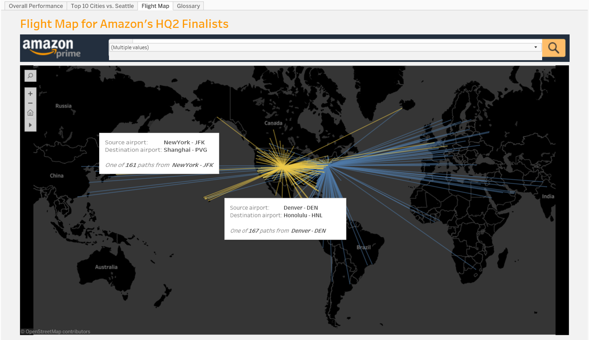

### Introduction

This article is intended to demonstrate two data visualizations. The first one is my individual work to visualize loan performance while the second viz is a group project aimed to compare Amazon HQ2 candidates. 

### Loan Viz

Click on the screenshot below to interact with it!


**How to use it?**

The main idea of the dashboard to show ‘performance’ with managers as my audience. 

The ‘top control’ is a term-specific filter and that will change the data the whole dashboard is showing.

The controls for section 1 and section 2 are applied to each section separately but the messages behind those views are logically connected. Section 1 is used to show general performance across states and over time while section 2 allows viewers to dig into more details in terms of grade and significant loss.

The first section is measured at month level. The key indicators are loan amount, number of loans and total interest received. There is an option to click on the state to show the time trend specific to that state. Choosing ‘month’ as pages is because the data is detailed to the month level and ‘month’ provides a lot of interesting variations over time.

The second section however is at the year level because it does not really make sense to allow so many variations between months to make the messages in section 2 elusive when showing grade performance and very bad loans. 2.1 is used to show whether loans of different grades have a pattern with regard to debt to income (risk) and interest rate (return) and how this pattern changed. 2.2 shows the gain, loss or the net value by summing gain and loss for each grade. Gain/Loss is calculated simply by the formula total payment – loan amount, regardless of time value of money. 2.3 is designed for users to quickly check some important attributes for a loan to learn about the features of bad loans. I created the loan ID by myself but they may use the real loan ID if they are interested in a specific one. They can control it by choosing loss ratio (loan amount - total payment / loan amount) and data is sorted by the amount of loss. Users can filter states and grades in section 2.

**What are the insights?**

California and New York are the two biggest markets. Debt to income seems to become a less important factor of grading over time. Different states have different gain/loss structures across grades. 

### Amazon HQ2 Shortlist Viz
Click on the screenshot below to interact with it!


This is a group project. The contributors are [Chengzhang (Jenny) Jiang](https://www.linkedin.com/in/chengzhang-jiang/), [Tsai-Yuan (Amy) Sung](https://www.linkedin.com/in/amytsaiyuansung/), [Eric Greenberg Goldy](https://www.linkedin.com/in/eric-greenberg-goldy/) and [Yunzhong (Gary) Gao](https://www.linkedin.com/in/garygaoyz/).

**What is the motivation?**

A year ago, Amazon announced it would be opening a second headquarter somewhere in North America and with it, Amazon would spend around $5 billion to build its HQ2 facility and create 50,000 jobs in the local community. This potential economic impact ignited a frenzy among cities to attract Amazon as their next home. Out of the 238 proposals Amazon received, 20 cities were narrowed down to a shortlist of viable finalists. However, during the selection process, Amazon released important characteristics it wanted for its new headquarters such as proximity to a major airport, ability to attract tech talent, a suburban or urban area with a population of more than 1 million people, and a strong transportation infrastructure. Amazon’s ultimate decision to split its HQ2 between Long Island City and Arlington Virginia was the result of some unknown weighted combination of preferences. Our project aims to use data science in order to visualize and better understand the reasoning behind Amazon’s decision.  

Some of the key characteristics Amazon looked at when determining the location of its next headquarters was not accessassable and ambiguous. Below is an excerpt from the official letter Amazon sent to its city finalists. 

“In choosing the location for HQ2, Amazon has a preference for: Metropolitan areas with more than one million people, a stable and business-friendly environment, urban or suburban locations with the potential to attract and retain strong technical talent, [and] communities that think big and creatively when considering locations and real estate options.  HQ2 could be, but does not have to be: an urban or downtown campus, a similar layout to Amazon’s Seattle campus a development-prepped site.  We want to encourage states/provinces and communities to think creatively for viable real estate options, while not negatively affecting our preferred timeline.”

Some of the information Amazon sought in its HQ2 was well defined and data friendly like a preference towards areas with a population of more than one million. However, some of the preferences, as seen above, were not well defined and were left to the creativity of the city to come up with an attractive offer. Among other ambiguous features in Amazon’s request for proposals, the official letter later says, “Incentives offered by the state/province and local communities to offset initial capital outlay and ongoing operational costs will be significant factors in the decision-making process.” Not all city incentives, however, were publicly disclosed. In addition, the list of features in Amazon’s outline is not a comprehensive one.  Therefore, in creating our visualization predicting Amazon’s next headquarters, we used some of the features Amazon included in its official proposal and some other ones we deemed relevant.  In particular we used 15 total features and broke them down into 5 categories: transportation, demographic, quality of life, business friendliness, and technology friendliness. Through our interactive dashboard story, users can compare cities in these 5 categories, adjust their weights, and see how different cities emerge as the best site for Amazon's next headquarters.

**How to use it?**

In Dashboard 1, the user can select the weight they prefer in the lower left corner based on their preferences. For example, adjusting demographic weight to 10%, transportation weight to 60%, technology weight to 10%, and remain business friendliness and quality of life to 10% the ranking will change, and the resulting top 10 cities will become New York, Northern Virginia, Washington DC, Montgomery County, Denver, Boston, Austin, Dallas, Seattle, and Chicago. 

In Dashboard 2, the user will see these top 10 cities, which are organized according to their overall ranking. Since we are comparing cities to Seattle, Seattle is excluded in calculation of top 10 cities and so the 11th city, which is Columbus, is included. By clicking on the lollipop plot, scatter plot, or deviation plot the map on the left will show the zip code details of that city. For example, if we chose New York, New York will show up in the map and the user can see all other relevant information. Users can also select specific variables they wish to explore. For example in the screenshot below, we chose “Transit Score” for x axis, and “Airport Enplanements” for y axis for the scatterplot, and transit score for the deviation chart.

Dashboard 3 enables people to choose the city airport they wish to explore. For example, we chose New York and Denver in the chart below, the map displays all the unique direct flight routes from these cities.

**What are the insights?**

Although our project’s main question aims to explain the reasoning behind Amazon’s HQ2 choices, our visualization also gives a comprehensive analysis of twenty of the United State’s most prominent cities. Users can click and compare five different categories that encompass a total of fifteen features on our radar chart, and see how each city ranks depending on an individual’s, family’s, or organization’s preferences. Further, on our second dashboard page, the user can specifically compare and contrast cities for each of the fifteen features.  

Without knowledge of where Amazon was going to locate its next headquarters, our model predicts the order each city should be chosen in. As a predictive model, it is evident that Montgomery County, Washington DC, New York and Northern Virginia all fall within the top four cities for Amazon’s next headquarters (Seattle ranks 10). However, as a descriptive model, we can make New York and Northern Virginia the first and second best cities by adjusting the weight for transportation down to about 50%, technology friendliness to about 20%, quality of life at 100%, demographic to about 20%, and business friendliness at 100%. For Northern Virginia to be in the top place and New York in the second place, keep the same percentages as above, but reduce transportation down slightly. Based on this, we can observe Amazon put a weak emphasis on demographic and technology friendliness, a large emphasis on quality of life and business friendliness, and average emphasis on transportation. It is also important to note Washington DC, Montgomery County, and Northern Virginia are all very close to each other and share similar data, and therefore the difference between these cities’ rank can be attributed to specific building lot details or tax incentives that we do not have data on. With this in mind, our model can correctly identify Amazon’s HQ2 cities with high accuracy. 

Living in Atlanta, we were upset with Atlanta not being chosen by Amazon. But from the radar chart, we can clearly see the reason why. Atlanta has high performance in transportation, technology, business friendliness, and average performance in demographic. However, its score in quality of life is relatively low, which Amazon puts large emphasis on. Specifically, this could be due to Atlanta’s high score in the crime index and low levels of average expenditure. 

We also are able to see that Amazon did not pick its next location closely based on a city’s similarity to its current headquarters, Seattle. When looking at the overall shape of the radar chart, we can see that Chicago and Boston have the most similar shape with that of Seattle. Even though these cities have the most similar characteristics, they do not appear in the top tier and were not chosen for Amazon’s HQ2. In addition, by looking at the lollipop plot we can see that New York and Northern Virginia are fairly different to Seattle. The same follows for the deviation plot. Even by adjusting the weights across all the different features, New York and Northern Virginia are relatively not as similar to Seattle as other cities. Therefore, Amazon did not closely choose a headquarters based on its similarity to Seattle.  

Going deeper into specific features, the majority of top candidates surprisingly score higher than Seattle in terms of network speed and technology. This is because these variables are not major concerns for Amazon when it set up HQ1 in Seattle, or the cities we analyze gradually evolved to do better than Seattle over time. Deviance chart demonstrates comparisons to Seattle and brings insights about how New York and Northern Virginia (Arlington) perform at the feature level compared to other favorable cities. For example, we see a contrast phenomenon that New York has a high transit score and high average commute time that is up to 39 minutes. This observation explains connectivity of a transit system and how much time people spend commuting to work are two different concepts, highlighting the importance of looking at specific metrics in considering transportation. 

In the scatter plot shown below, we find New York (1) and Northern Virginia (2) don’t always lie the best quadrant indicated with “+”  after picking X and Y randomly. It sheds light on Amazon’s standard not to pick cities that do well in specific aspects, but rather have a more balanced performance across all the factors. Interestingly, the scatter plot can be used to detect certain correlation between features. For example, higher technology concentration index also brings up network speed. 

The flight map adds another reasoning for New York and Arlington being Amazon's final choice. These two cities can easily reach plenty of areas of the world by air. However, for some cities like Nashville with only 47 flight paths, it seems unlikely that Amazon will base its HQ2 there.
