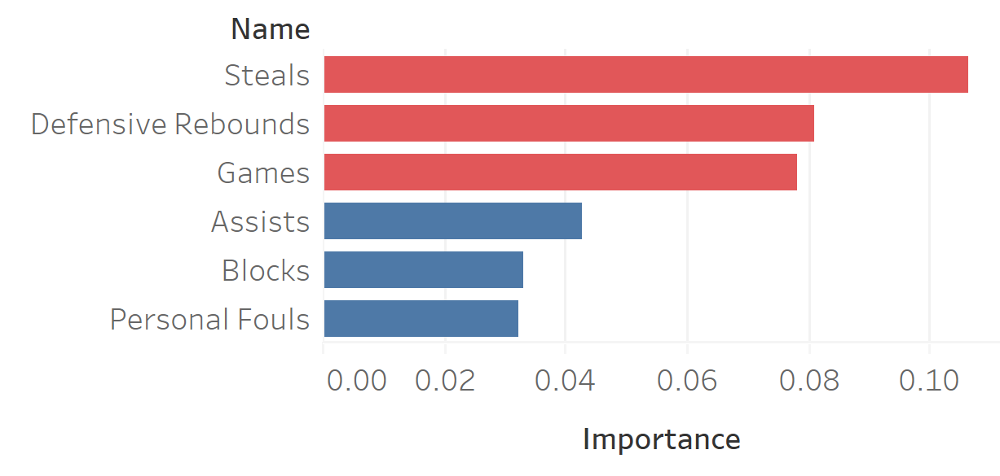
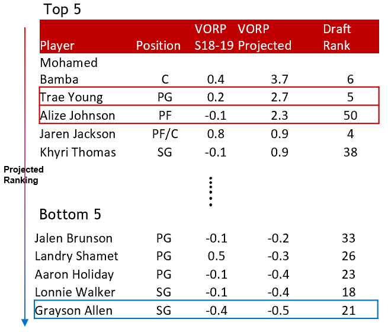

Here is the NBA draft analysis I conducted.

Click on the picture below to get the codes!


### Write-up

According to Wikipedia, the NBA draft happens every year in June. It is where teams in the National Basketball Association (NBA) choose players who have never played in the NBA before. This analysis is intended to shed some light on which college stats are most predictive in terms of their early success. The teams can take advantage of it as a reference when scouting players. This can also help recognize talents that deserve the attention and ‘draft busts’ who are overestimated. 

I applied several machine learning models in order to predict players performance early in their professional career. Among regularized linear models, KNN and random forests, random forests stand out as the best with lowest mean square error (MSE) in test data, 1.536. Three-year VORP is used as a proxy of ‘early success’, which is specifically NBA prospects’ value above replacement over their first three seasons in the league. I take into account college stats including games they played and per-game measures like field goals, field goals attempted, free throws, assists, rebounds, steals, blocks and turnovers. Since international players are in face of different levels of competition compared to American players, the analysis does not include international players. In training the model, college prospect modeled are drafted between 2011 through 2017.

The NBA and college data comes from four sources: Basketball Reference, Sports Reference, NBA.com, and Draft Express.

Graph 1 Top 3 and bottom 3 predictive variables

  
Regarding the findings, the most predictive variables for early NBA success (in terms of VORP) are steals, defensive rebounds, games, two-point field goal attempts and height. The least predictive variables in the model are the player’s wingspan, turnovers, assists, blocks and personal fouls. The top 3 and bottom 3 variables are shown above in the graph with their importance scores output by the algorithm. In 2018 draft projection, the most promising player identified by the model is Mohamed Bamba with a ranking of 6 in the real draft. Trae young, as a rising star regarded by many fans, ranks the second in my projection with a projected VORP being 5. Interestingly, Alize Johnson ends up being in the top tier but his real order in the draft is 50, indicating he could be a player with high potential but is not fairly valued. The last player is Grayson Allen whose ranking in 2018 draft is 21, meaning the player is overrated to some extent.

The top 5 and bottom 5 players are listed below in the table below.

Table 1 Top 5 and bottom 5 players of the model

  
Among the last 5 players, their draft rankings tend to fall in the middle ranging from 20 to 40.  It is noted that when comparing VORP projected to VORP Season 2018-19, VORP season may vary a lot as the seasons goes on and more seasons are counted in the future. The differences between this metric and VORP I estimated seem reasonable across all these players and let us wait and see whether the VORP will ultimately move towards my predictions.
As put by McCool (2017), other factors including injury history and even player psychology can have an effect on future success in the NBA. Additionally, VORP is said to overvalue steals and blocks and underrates defensive specialists that do not generate a ton of steals and blocks. Nonetheless, the model shows that analytics could potentially play an important role in talent evaluation and should continue to provide insightful guidance in the NBA draft in the coming years.

<object data="../assets/pdf/draft_analysis.pdf" type="application/pdf" width="600px" height="500px">
    <embed src="../assets/pdf/draft_analysis.pdf">
    </embed>
</object>

### Reference
https://www.cmusportsanalytics.com/2017-nba-draft-forecast/

http://www.basketball-reference.com/

http://www.draftexpress.com/

http://www.sports-reference.com/

https://www.nba.com/

